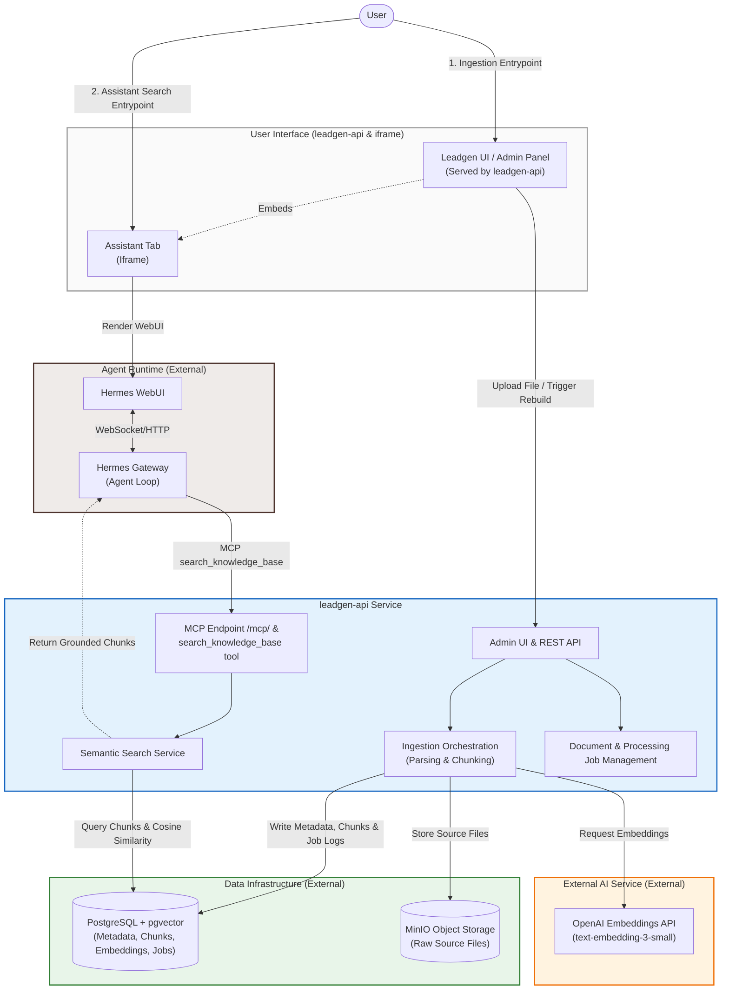

# Leadgen API - Knowledge Base Service

A FastAPI-based service for document ingestion, processing, and semantic search, designed to power autonomous agent workflows.

---

## 1. Project Overview
`leadgen-api` acts as the document storage, parsing, chunking, embedding, and semantic retrieval service for the Leadgen Agent platform. It exposes a JSON REST API and integrates with agent platforms using the Model Context Protocol (MCP) to provide clean, grounded document context.

---

## 2. Project Structure

```text
leadgen-api/
├── src/
│   ├── __init__.py
│   ├── main.py                  # FastAPI application entry point & router mounting
│   ├── config.py                # Configuration management and env validation
│   ├── api/
│   │   ├── __init__.py
│   │   ├── mcp.py               # Model Context Protocol FastMCP server
│   │   ├── ui.py                # Built-in internal admin panel UI
│   │   └── v1/
│   │       ├── __init__.py
│   │       ├── health.py        # System and dependency health check router
│   │       ├── documents.py     # Document management, search, and version control router
│   │       ├── ingestion.py     # Ingestion queue and manual processing jobs router
│   │       └── hermes.py        # Programmatic Hermes Gateway test integration router
│   ├── services/
│   │   ├── __init__.py
│   │   ├── database.py          # PostgreSQL transactions, vector queries, and schema actions
│   │   ├── minio_service.py     # MinIO S3 object download and versioned uploads
│   │   ├── document_parser.py   # Multi-format document parser (PDF, TXT, MD, CSV, DOCX, XLSX)
│   │   ├── chunker.py           # Text segmentation chunking helper
│   │   ├── embedding_service.py  # OpenAI embeddings API client integration
│   │   ├── ingestion_service.py  # Core text extraction, parsing, and embedding coordinator
│   │   ├── search_service.py    # Semantic search query coordination helper
│   │   └── hermes_client.py     # Programmatic client wrapper for Hermes Gateway API
│   ├── models/
│   │   ├── __init__.py
│   │   └── schemas.py           # Pydantic schema validation structures
│   └── utils/
│       ├── __init__.py
│       └── logging.py           # System logger configurations
├── tests/
│   ├── __init__.py
│   ├── conftest.py              # Pytest configuration and client mock database fixtures
│   ├── test_document_stabilization.py  # Database race condition and job concurrency tests
│   ├── test_documents.py        # Ingestion, search, and document metadata endpoint tests
│   ├── test_health.py           # Database and MinIO health check endpoint tests
│   ├── test_hermes.py           # Hermes client wrappers and error handling tests
│   ├── test_ingestion.py        # Process-next queue and failed job retry tests
│   ├── test_mcp.py              # MCP tool schemas, Bearer auth, and DNS rebinding protection tests
│   ├── test_multi_format_parser.py  # Multi-format parsing and upload type handling tests
│   ├── test_services.py         # Chunker, embeddings, and database retrieval unit tests
│   └── test_ui.py               # Serves internal Admin UI view tests
├── docs/
│   ├── API.md                   # REST and MCP complete parameters reference
│   ├── ARCHITECTURE.md          # Scoring algorithms, diagrams, and volume contracts
│   ├── DECISIONS.md             # ADR architectural design history log
│   ├── PROJECT_CONTEXT.md       # Historical project definition scoping
│   ├── ROADMAP.md               # Historical initial phases checklists
│   ├── database-setup.md        # Migration commands, backups, and vector guide
│   └── schema.sql               # PostgreSQL tables and index setup SQL commands
├── Dockerfile                   # Container build recipe
├── docker-compose.yml           # Local API compose configuration
├── docker-compose.dev.yml       # Hostinger staging/development compose rules
├── docker-compose.prod.yml      # Hostinger production compose rules
├── requirements.txt             # Primary production python dependencies
├── requirements-dev.txt         # Dev-specific dependencies (black, flake8, pytest, etc.)
└── .env.example                 # Example configuration templates file
```

---

## 3. Current Capabilities
* **Multi-Format Processing**: Extracts text and tables from standard document formats (PDF, TXT, MD, CSV, DOCX, XLSX).
* **Automated Chunking & Embedding**: Chunks extracted content and generates embeddings via OpenAI models.
* **Semantic Vector Search**: Searches document chunks using pgvector with custom metadata-based filtering.
* **Model Context Protocol (MCP)**: Exposes semantic search as a stateless MCP tool named `search_knowledge_base`.
* **Internal Admin UI**: Built-in visual interface to upload files, review ingestion job history, manage metadata, and test semantic queries.
* **Archiving & Recovery**: Soft-delete option to exclude specific documents from search indexes while retaining source files.

---

## 4. High-Level Architecture
The system architecture separates the local interface and data layer of the `leadgen-api` service from the external agent execution runtime, database, storage, and AI services.



### High-Level Service Flows

#### 1. Document Ingestion Flow
User/Admin UI → `leadgen-api` (Admin UI & REST API) → Ingestion Orchestration → `MinIO` (for source files) & `PostgreSQL` (for metadata, chunks, embeddings, and job runs), invoking `OpenAI Embeddings API` during embedding generation.

#### 2. Assistant Search Flow
User → Leadgen Assistant Iframe → `Hermes WebUI` (loads in iframe) → `Hermes Gateway` (evaluates agent reasoning loop) → MCP `search_knowledge_base` (invoked via stateless `/mcp/` endpoint) → `leadgen-api` (Semantic Search Service) → `PostgreSQL + pgvector` (fetches matched chunks and similarity scores) → Grounded chunks returned to `Hermes Gateway` over MCP transport.

> [!IMPORTANT]
> **Separation of Concerns**: This repository (`leadgen-api`) only provisions the FastAPI backend container and the admin interface. External components like **PostgreSQL**, **MinIO**, **Hermes Gateway**, and **Hermes WebUI** are separate infrastructure elements that are run externally or in separate containers connected via the shared `leadgen_net` Docker network.

---

## 5. Supported Document Formats
The document parser processes the following file extensions:
* **PDF** (`.pdf`) - extracts text page-by-page.
* **TXT** (`.txt`) - decodes UTF-8 plain text.
* **Markdown** (`.md`, `.markdown`) - decodes markdown text.
* **CSV** (`.csv`) - parses structured table rows delimited by `|`.
* **DOCX** (`.docx`) - extracts paragraphs and text tables.
* **XLSX** (`.xlsx`) - parses spreadsheet cells sheet-by-sheet, delimited by `|`.

---

## 6. Ingestion and Retrieval Flow

### Pipeline Execution
1. **Upload**: User uploads a file via the multipart `/upload` endpoint or registers metadata for a file already inside MinIO via `/ingest`.
2. **MinIO Storage**: Raw source files are uploaded to the `leadgen-docs` bucket.
3. **Parsing**: The file bytes are downloaded and passed to the specific format parser.
4. **Chunking**: Text is split into overlapping chunks (configured via safety limits).
5. **OpenAI Embeddings**: The chunks are sent to OpenAI to generate 1536-dimensional vectors.
6. **Postgre SQL**: Chunks, metadata, and vectors are saved, replacing any older chunks for the document.
7. **Semantic Search**: Chunks are matched using pgvector.

### Document & Job Statuses
* **Document Statuses**:
  * `uploaded`: Metadata registered, source file stored in MinIO.
  * `processing`: Text extraction, chunking, or embedding is actively running.
  * `processed`: Ingestion succeeded; chunks and vector embeddings are ready in the database.
  * `failed`: Ingestion job failed.
  * `archived`: Soft-deleted state; excluded from search but metadata and source remain.
* **Job Statuses**:
  * `pending`: Job is queued.
  * `processing`: Ingestion pipeline is executing the job.
  * `completed`: Job finished successfully.
  * `failed`: Job aborted (logs errors in the database).

> [!IMPORTANT]
> **Index Availability Rule**: Only documents with the `processed` status participate in search queries. Uploaded, processing, failed, or archived documents are automatically excluded from semantic vector queries.
>
> **Metadata Edits**: Making metadata changes (e.g. updating client names, geography, or tags via `PATCH /documents/{id}`) only updates DB columns and does **not** trigger a re-ingestion job.

---

## 7. Local Development

### Virtual Environment Setup
```bash
# Create and activate virtual environment
python -m venv venv
source venv/bin/activate  # On Windows: venv\Scripts\activate

# Install dependencies
pip install -r requirements.txt
```

### Running Locally
```bash
# Copy template environment file
cp .env.example .env

# Run local development server (port 8000)
uvicorn src.main:app --reload --port 8000
```
Visit the Admin UI locally at `http://localhost:8000/ui`.

### Running Tests
Ensure dev dependencies are installed, then run the test suite:
```bash
pytest
```

---

## 8. Deployment
The API container is configured to run internally on port `8000`.

### Docker Compose Services
This repository includes Docker Compose definitions for deployment:
* **Development** (`docker-compose.dev.yml`): Runs the container with a local mapping `3001:8000` (exposing host port `3001` to container port `8000`) and hooks into the external `leadgen_net` network.
* **Production** (`docker-compose.prod.yml`): Hooks port `8000` directly and sets up routing rules for Traefik (supporting HTTPS via Let's Encrypt certificates).

*Note: PostgreSQL, MinIO, Traefik, and the Hermes Agent stack are external to this project and must be running on the host or inside the same Docker network (`leadgen_net`).*

---

## 9. Environment Variables Reference

| Variable Name | Service | Required | Purpose / Description | Example / Placeholder |
| :--- | :--- | :--- | :--- | :--- |
| `DEBUG` | API | No | Enables debug logging and FastAPI debug mode. | `false` |
| `OPENAI_API_KEY` | API | Yes | OpenAI API Key for generating embeddings. (Secret) | `sk-proj-placeholderkey` |
| `EMBEDDING_MODEL` | API | No | Target embedding model. | `text-embedding-3-small` |
| `POSTGRES_HOST` | API | Yes | Target PostgreSQL database hostname. | `leadgen-postgres` |
| `POSTGRES_PORT` | API | Yes | Target PostgreSQL port. | `5432` |
| `POSTGRES_DB` | API | Yes | Target database name. | `leadgen` |
| `POSTGRES_USER` | API | Yes | Database username. | `leadgen` |
| `POSTGRES_PASSWORD` | API | Yes | Database password. (Secret) | `your_secure_password` |
| `MINIO_ENDPOINT` | API | Yes | Endpoint of the MinIO storage. | `http://minio:9000` |
| `MINIO_ACCESS_KEY` | API | Yes | MinIO Access Key. (Secret) | `minioadmin` |
| `MINIO_SECRET_KEY` | API | Yes | MinIO Secret Key. (Secret) | `minioadmin` |
| `MINIO_BUCKET` | API | No | Target MinIO bucket. | `leadgen-docs` |
| `MINIO_SECURE` | API | No | Force SSL/TLS for MinIO. | `false` |
| `HERMES_WEBUI_URL` | API | Yes | Public HTTPS URL of the external Hermes WebUI (rendered inside the UI assistant tab iframe). | `https://hermes-webui.domain.com/` |
| `MCP_ENABLED` | API | No | Enable/disable mounting the MCP ASGI app subtree. | `true` |
| `MCP_API_KEY` | API | Yes | Key protecting the `/mcp` endpoints via Bearer token. (Secret) | `your_mcp_api_key` |
| `MCP_ALLOWED_HOSTS`| API | No | Comma-separated allowed Host headers for DNS rebinding protection. | `localhost:*,leadgen-api:8000` |
| `MCP_ALLOWED_ORIGINS`| API | No | Comma-separated allowed origins. | `""` |

---

## 10. REST API Overview
The REST API provides endpoints for document uploading, ingestion tracking, metadata modifications, search queries, and health status.

A detailed description of all request bodies, query parameters, and response structures is available in the [API Reference Guide](docs/API.md).

### Quick Summary of Endpoint Paths:
* `GET /health` - Check PostgreSQL & MinIO storage health.
* `POST /api/v1/documents/upload` - Upload a source file and immediately trigger ingestion.
* `POST /api/v1/documents/ingest` - Register metadata for an existing MinIO object and queue ingestion.
* `GET /api/v1/documents` - Retrieve all documents with counts.
* `GET /api/v1/documents/{document_id}` - Retrieve details of a document.
* `PATCH /api/v1/documents/{document_id}` - Update title and metadata without re-ingesting.
* `POST /api/v1/documents/{document_id}/reingest` - Re-parse, chunk, and embed current source file.
* `POST /api/v1/documents/{document_id}/replace-file` - Upload a new file version and rebuild the index.
* `POST /api/v1/documents/{document_id}/archive` - Archive document (removes from search results).
* `POST /api/v1/documents/{document_id}/restore` - Restore document (makes searchable if chunks exist).
* `GET /api/v1/documents/{document_id}/jobs` - List job history for a document.
* `POST /api/v1/documents/search` - Query chunks semantically.

---

## 11. Model Context Protocol (MCP) Integration
`leadgen-api` hosts a stateless MCP server that exposes the `search_knowledge_base` tool to external agent runtimes (like the Hermes Gateway).

### Key Features
* **Stateless Transport**: Employs stateless HTTP (`stateless_http=True` and `json_response=True` are configured on FastMCP).
* **Bearer Token Security**: Protected by `MCPAuthMiddleware` using `MCP_API_KEY` in the `Authorization` header.
* **DNS Rebinding Protection**: Validates requests against the `MCP_ALLOWED_HOSTS` list.
* **Zero Query Duplication**: Uses the core search service directly without executing additional queries.

See [MCP Integration Guide](docs/ARCHITECTURE.md#model-context-protocol-mcp) in the architecture documentation for setup instructions.

---

## 12. Generated Files & Shared Workspace
The Hermes Gateway and Hermes WebUI share a mounted external host volume mapped at `/workspace`. This volume is used for reading agent instructions and saving output files.

### Workspace Specifications
* **Instruction Profiles**:
  * `SOUL.md`: Global persona and system instruction templates.
  * `/workspace/AGENTS.md`: Workspace-level agent guidelines.
  > [!WARNING]
  > These files configure agent behavior and do not provide security isolation.
* **Generated Outputs**: Outputs created by agents are placed under `/workspace/generated/<task-name>/`.
* **Media Paths**: Assets are returned using absolute `MEDIA:` prefixes (e.g. `MEDIA:/workspace/generated/task/chart.png`), which the Hermes WebUI handles for file download.

---

## 13. Current Operational Notes

### UI Terminology and Actions
The internal Admin UI (`GET /ui`) matches the backend state and includes specific buttons:
1. **`Replace & Rebuild`**: Uploads a new source file version to MinIO under a versioned path and automatically triggers a rebuild index job.
2. **`Rebuild Search Index`**: Triggers re-parsing and embedding calculation of the current source file.
3. **`Archive Document` / `Restore Document`**: Toggles document search availability.
4. **`↻ Refresh`**: Located on the documents page. It retrieves the updated document listings and status counts from the database; it **does not** start any job.
5. **`Reload Jobs`**: Located in the modal's job history panel. It retrieves the latest job log rows; it **does not** start any job.
6. **`Process immediately (parse → chunk → embed)`**: Checkbox in the upload screen to execute jobs synchronously.

### Metadata Updates
Editing fields (e.g. updating description or tags in the edit document modal and clicking **Save**) will **not** rebuild the vector chunks or reset embeddings. Re-ingestion is only required when the source file content changes.

---

## 14. Links to Detailed Docs
* [Architecture Guide](docs/ARCHITECTURE.md) - Details components, similarity scoring, and the MCP layout.
* [API Reference](docs/API.md) - Contains payload models, JSON structures, and query endpoints.
* [Database Setup Guide](docs/database-setup.md) - Commands for schema creation, backups, and pgvector setups.
* [Historical Context: Decisions Log](docs/DECISIONS.md) - Architectural Decisions Log (ADR) detailing design history.
* [Historical Context: MVP Project Specification](docs/PROJECT_CONTEXT.md) - Original MVP scoping notes.
* [Historical Context: Project Roadmap](docs/ROADMAP.md) - Original project phases.
