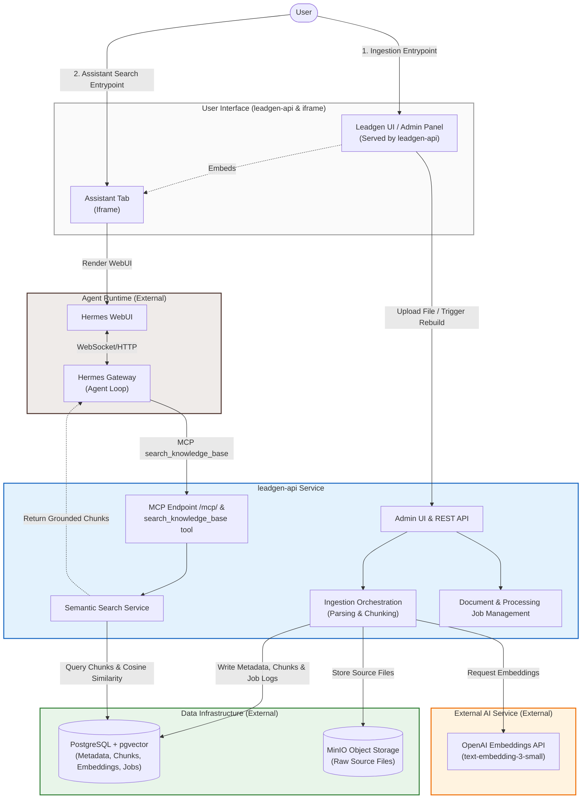
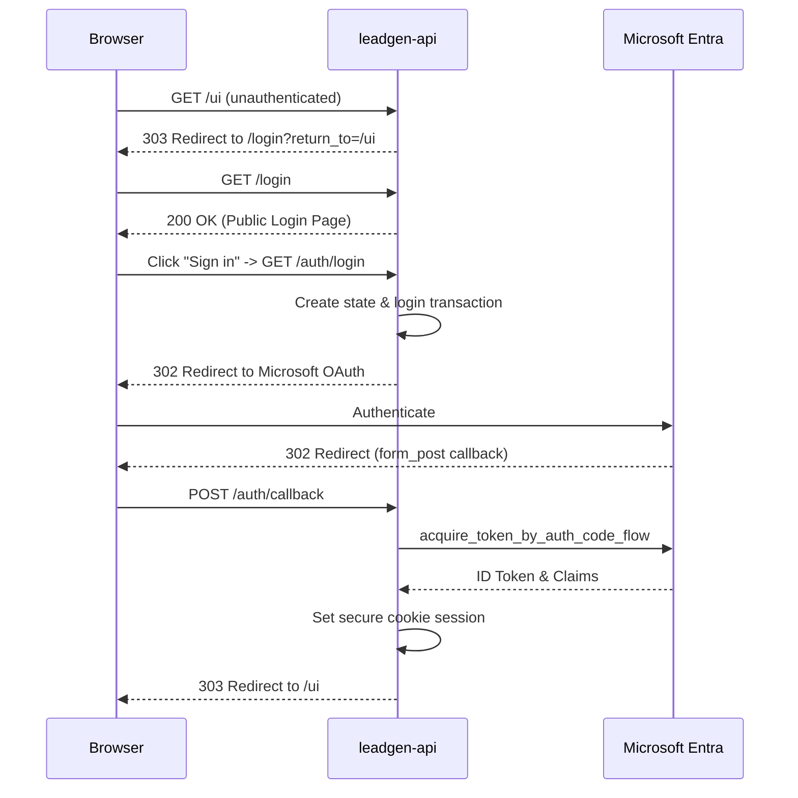

# Architecture Guide

This document describes the component relationships, data flow, scoring semantics, and integration designs of the Leadgen API service.

---

## High-Level Component Layout
The application forms the storage and semantic retrieval layer of the agent platform. It communicates via the internal Docker network `leadgen_net` with external databases, storage, and runtime stacks.



---

## Component Responsibilities

### 1. External Agent Stack (Hermes Gateway & WebUI)
* **Hermes WebUI**: The web portal rendering the chat interface. It embeds/interacts with the agent runtime.
* **Hermes Gateway**: The orchestration and agent execution engine. It coordinates agent tools, maintains session memory, runs the reasoning loop, and invokes API tools via MCP.
* **Data Access Restricton**: The agent stack does **not** directly query PostgreSQL or connect to MinIO. All semantic search operations must go through the tool API.

### 2. leadgen-api
* **Ingestion Pipeline**: Downloads raw files, extracts text (per format specifications), splits text into overlapping semantic blocks (chunks), generates embeddings via OpenAI, and persists chunks and vectors.
* **Semantic Search**: Exposes standard query interfaces (REST and MCP) using vector indexing and similarity queries.
* **Metadata Directory**: Manages document records, file version tracking, soft-archiving, and job runs logging.
* **Admin UI**: Serves static pages and forms to allow administration of the documents directory.

### 3. External Database & Storage
* **MinIO Object Storage**: S3-compatible system storing the original raw document files inside the `leadgen-docs` bucket.
* **PostgreSQL + pgvector**: Database storing document metadata, job histories, chunks, and float vector arrays (1536 dimensions) for exact search matching.

---

## Supported Formats & Parsing

The parser extracts clean text and structured data from the following formats:
* **PDF**: Extracted page-by-page.
* **TXT**: Decoded as raw UTF-8.
* **Markdown**: Decoded as raw UTF-8 text.
* **CSV**: Row-by-row mapping, formatted as `Row N: cell1 | cell2`.
* **DOCX**: Extracts paragraph blocks and tables.
* **XLSX**: Iterates worksheets, formatting rows as `Row N: cell1 | cell2`.

> [!NOTE]
> Format parsing is extension-driven with MIME-type fallback detection. PPTX is not supported by the current parsing implementation.

---

## Semantic Vector Search & Scoring

### Similarity Calculation
Semantic search queries are converted into OpenAI embeddings and matched against document chunk vectors in PostgreSQL.
The query uses pgvector's distance operators inside an SQL search query:
```sql
SELECT
    ...,
    1 - (c.embedding <=> $1::vector) AS score
FROM document_chunks c
JOIN documents d ON d.id = c.document_id
WHERE c.embedding IS NOT NULL AND d.status = 'processed'
ORDER BY c.embedding <=> $1::vector ASC
LIMIT $2
```

### Score Semantics
* The `<=>` operator computes the **cosine distance** between the query embedding and the chunk embedding.
* The score field returned by the API is calculated as `1 - cosine_distance`.
* This yields the **cosine similarity**.
* The theoretical range of cosine similarity is `[-1, 1]`.
* **Higher scores indicate closer semantic similarity** (closer to `1.0` is a stronger match).
* Semantic queries exclude any documents that are archived, failed, processing, or registered but not yet processed (only `processed` documents are searchable).

---

## Model Context Protocol (MCP)

`leadgen-api` mounts an MCP ASGI application at `/mcp` which acts as a bridge for agent discovery.

### MCP Configuration
* **Server Library**: Built on `FastMCP`.
* **Stateless HTTP Transport**: Runs in `stateless` mode (`stateless_http=True` and `json_response=True` are explicitly set).
* **Discoverable Tool**: Exposes the `search_knowledge_base` tool.
* **Security & Network Protections**:
  * Protected via `MCPAuthMiddleware` enforcing Bearer tokens (`MCP_API_KEY`).
  * Integrates DNS Rebinding Protection checking incoming headers against `MCP_ALLOWED_HOSTS`.
* **Database Efficiency**: The MCP tool invokes the internal semantic search service directly, ensuring search operations reuse the same optimized PostgreSQL query paths without duplicating logic.

---

## Generated Files & Shared Workspace

The agent gateway and web interface utilize a shared storage directory mapped in their respective container environments.

### Workspace Volume Contract
* **Shared Mount**: A shared host volume mounted at `/workspace` in the containers.
* **Output Path**: Final artifacts generated by the agent are placed under `/workspace/generated/<task-name>/`.
* **Media Protocol**: Output paths are returned through absolute prefixes (e.g. `MEDIA:/workspace/generated/...`), which allows the WebUI to map file downloads.
* **Instruction Models**:
  * `SOUL.md`: Global system prompt files.
  * `/workspace/AGENTS.md`: Workspace-specific prompt profiles defining guidelines.
  > [!WARNING]
  > These files configure agent instructions and do **not** provide network, system, or database security isolation.

---

## Authentication Flow

`leadgen-api` relies on Microsoft Entra ID (MSAL) for internal admin UI security. 



### Logout Flow
1. User clicks "Sign out" (triggers a POST form to `/auth/logout`).
2. API validates the authenticated session, clears the local secure cookie, and redirects the browser to the Microsoft Entra `end-session` endpoint.
3. Microsoft logs the user out globally (for this session) and redirects to the configured post-logout URI (`/auth/signed-out`).
4. API intercepts `/auth/signed-out` and redirects to `/login?logged_out=1`.
5. Browser renders the public login page with a safe success message.
